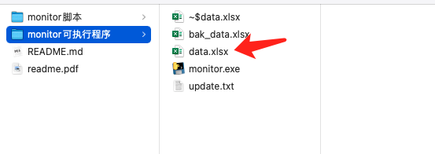
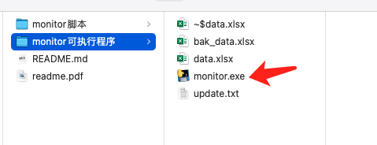

## 简介

简单的渠道app版本更新检测程序，目前支持华为（huawei）、小米（xiaomi)、苹果(apple)渠道。如果只是本地人工维护，可以直接运行monitor可执行程序文件夹下的`monitor.exe`随时更新。

如果想对接公司的告警系统，可以在pyhton脚本中添加告警方法部署时设置定时任务。

## 下载文件

点击链接 https://github.com/muchener/app_monitor/archive/refs/heads/main.zip 下载并解压。

## 使用方法（适用windows)

进入【monitor可执行程序】文件夹。

**Step1：修改data.xlsx文件，加入需要检测的App**

字段解释如下：

`no`:序号，请按顺序编写，偷懒用no字段做了行数，写错会导致填写错误

`App_name`: App名称

`channel`:  渠道名称，目前可选apple(苹果应用商店)、huawei(华为应用商店)、xiaomi(小米应用商店)、tencent(应用宝)。

`package`:包名，有些渠道是直接用的报名，有些渠道有自己的命名规范，请查看**附录:package查找方式**。

`version`:版本名称，初始可不填，第一次运行程序会自动添加。

`update`:更新时间，注意这里更新时间获取的是运行程序时间，而非app上架时间。初始可不填，第一次运行程序会自动添加。

**Step2: 点击运行monitor.exe**

这里注意，最新运行的结果文件为`data.xlsx`，上一个版本的文件（备份）为`bak_data.xlsx`，以便崩溃找回文件。

`update.txt`是更新记录，方便查看。

## 附录 package查找方式

**1 小米渠道xiaomi**

通过小米应用商店https://app.mi.com/ 查询需要查看版本的app，点击app详情页，package的值为url中的id值。

例如：QQ，小米应用商店url：https://app.mi.com/details?id=com.tencent.mobileqq&ref=search ，package值为**com.tencent.mobileqq**。

**2 华为渠道huawei**

通过华为应用商店https://appstore.huawei.com/ 查询需要查看版本的app，点击app详情页，package的值为url中的Cxxx。

例如：QQ，华为应用商店url：https://appstore.huawei.com/#/app/C9319 ，package值为**C9319**。

**3 苹果应用商店apple**

手机AppStore搜索App，分享url后查看url，package的值为url中的idxxxxxx。

例如：QQ，分享url链接https://apps.apple.com/cn/app/qq-2011/id444934666 ，package的值为url中的**id444934666**。

